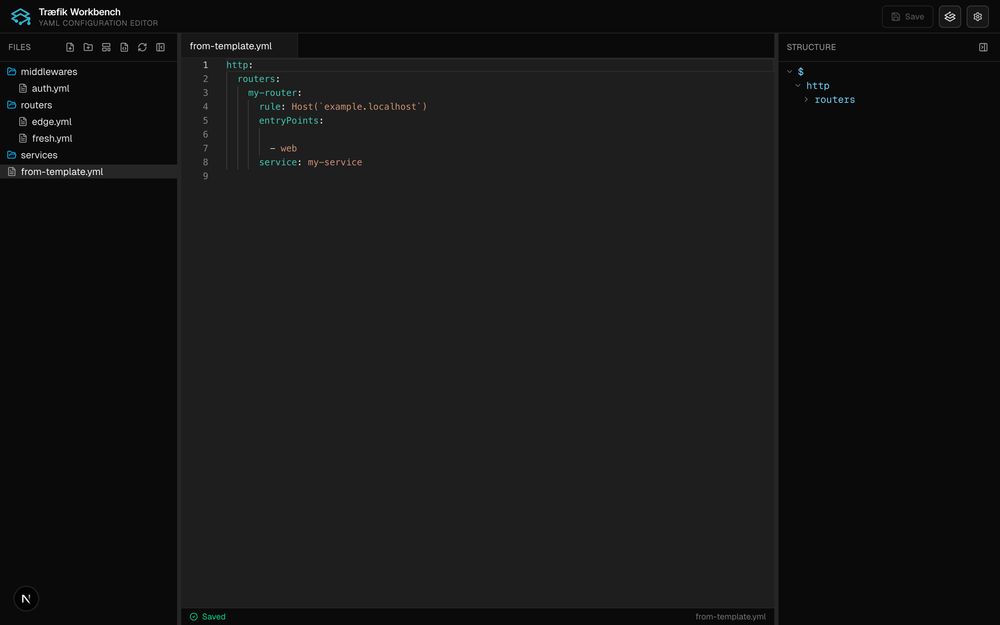
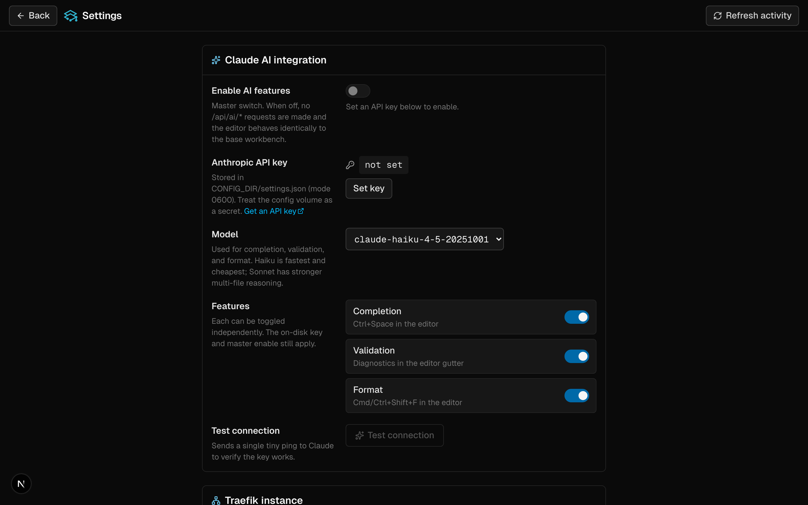

<p align="center">
  
</p>

<h1 align="center">Træfik Workbench</h1>

<p align="center">
  A lightweight, self-hosted YAML editor for Traefik dynamic config — file tree, Monaco editor, live structure outline, and an opt-in Claude assist layer. Edit your routers, services, and middlewares from a browser instead of SSH.
</p>

## AI Contribution Disclosure

> [!IMPORTANT]
> This project uses [Level 5 AI assistance](https://www.visidata.org/blog/2026/ai/) — AI generated the majority of the code, but the human was involved at every step, reviewing each line with full attention. The human understands every algorithm and has logically validated how it all works.
>
> **AI Model:** Claude Opus 4

## Screenshots

| Editor | Settings |
| :----: | :------: |
|  |  |

## Features

- **Left pane:** file tree browser for the mounted data directory — create, rename, delete files and folders in place
- **Center pane:** Monaco editor with YAML syntax highlighting, multi-file tabs, dirty indicators, Cmd/Ctrl+S to save the active file, Cmd/Ctrl+W to close
- **Right pane:** live YAML structure outline — click any node to jump the editor to that line
- **Templates:** copy curated YAML snippets from a separate templates directory into your config
- **Unsaved-changes guard:** confirmation on close, plus a browser `beforeunload` prompt
- **Persistent layout:** collapse or resize either side pane; widths survive reloads
- **AI features (optional):** opt-in Claude-backed completion, validation, and format. Off by default; configured from a Settings page in the UI. See [AI features (optional)](#ai-features-optional) below.

## Tech Stack

- Next.js 16 (App Router) + TypeScript (strict)
- Tailwind CSS v4
- Monaco Editor (`@monaco-editor/react`)
- `yaml` (preserves comments and formatting)
- `react-arborist` (file tree)
- Vitest + React Testing Library (unit/component tests)
- Playwright (E2E)

## Quick Start (Docker)

The fastest way to run traefik-workbench against an existing Traefik config directory:

```bash
# 1. Point the compose file at your host's Traefik dynamic config dir.
export DATA_DIR_HOST=/etc/traefik/dynamic

# 2. (Optional) Point at a templates directory.
export TEMPLATES_DIR_HOST=./templates

# 3. Start it.
docker compose up -d
```

Then open <http://localhost:3000>.

By default the compose file pulls the published image from `ghcr.io/shawnphoffman/traefik-workbench:latest`. To build from source instead, uncomment the `build:` block in [`docker-compose.yml`](./docker-compose.yml).

### Environment variables

| Variable             | Default       | Description                                                                                              |
| -------------------- | ------------- | -------------------------------------------------------------------------------------------------------- |
| `DATA_DIR`           | `/data`       | Absolute path (inside the container) to the directory of YAML files the workbench can read and write.   |
| `TEMPLATES_DIR`      | `/templates`  | Absolute path (inside the container) to a directory of template YAML snippets to copy into `DATA_DIR`. Mount read-write to allow editing templates from the UI. |
| `CONFIG_DIR`         | `/config`     | Absolute path (inside the container) where the workbench persists its settings file (`settings.json`).  |
| `ANTHROPIC_API_KEY`  | _(unset)_     | Optional fallback for the Claude API key. Used only when no key is set from the Settings page. Docker-secret friendly. |
| `PORT`               | `3000`        | Port the Next.js server listens on inside the container.                                                 |
| `HOSTNAME`           | `0.0.0.0`     | Bind address. Leave as-is for container deployments.                                                     |

All paths are sanitized against `DATA_DIR` / `TEMPLATES_DIR` before any filesystem call — user input cannot escape the configured roots.

### Running behind Traefik

The included `docker-compose.yml` has a commented-out block of Traefik router labels. Uncomment and adjust the hostname and cert resolver, then attach the container to the same docker network as your Traefik instance:

```yaml
    networks:
      - traefik-public
    labels:
      traefik.enable: "true"
      traefik.docker.network: "traefik-public"
      traefik.http.routers.workbench.rule: "Host(`workbench.example.com`)"
      traefik.http.routers.workbench.entrypoints: "websecure"
      traefik.http.routers.workbench.tls.certresolver: "letsencrypt"
      traefik.http.services.workbench.loadbalancer.server.port: "3000"

networks:
  traefik-public:
    external: true
```

> **Security note:** traefik-workbench has no built-in authentication. Always put it behind an authenticating proxy (Traefik's [BasicAuth middleware](https://doc.traefik.io/traefik/middlewares/http/basicauth/), [forward-auth](https://doc.traefik.io/traefik/middlewares/http/forwardauth/), or an OIDC gateway) before exposing it to the public internet.

### Building the image manually

```bash
docker build -t traefik-workbench .
docker run -d \
  -p 3000:3000 \
  -v /etc/traefik/dynamic:/data \
  -v "$PWD/templates:/templates" \
  --name traefik-workbench \
  traefik-workbench
```

The image is a multi-stage build that uses Next.js's `output: 'standalone'` mode, runs as an unprivileged `nextjs` user (uid `1001`), and exposes a healthcheck on `/`.

## AI features (optional)

Traefik configs are exactly the kind of document where structural validation and cross-file awareness pay off — for example, "this `service:` references a service that doesn't exist in any other file". The workbench has an opt-in layer that uses [Claude](https://www.anthropic.com/claude) for that.

**It is off by default.** When disabled, no `/api/ai/*` requests are made, the editor behaves identically to a vanilla workbench, and the Anthropic SDK is never invoked.

### What you get when it's on

- **Completion** — Traefik-aware suggestions on Ctrl+Space and on `:` / `-` / space triggers, scoped to the active file's type (static or dynamic).
- **Validation** — Claude scans the active file in the context of its workspace siblings and pushes diagnostics into Monaco's gutter.
- **Format** — `Cmd/Ctrl+Shift+F` reformats the active file. The result is rejected if it changes any semantic content (the parsed YAML must round-trip identically), so Claude can never silently rewrite a value.

A small status pill in the editor footer shows what the AI subsystem is doing (idle / thinking / clean / error).

### Enabling it

1. Click the gear icon in the header to open the **Settings** page.
2. Paste your Anthropic API key (`sk-ant-...`) into the **Anthropic API key** field.
3. Pick a model (Haiku / Sonnet / Opus) and toggle the features you want.
4. Click **Test connection** to verify the key works.
5. Flip the **Enable AI features** master switch on.

The Settings page also exposes a **Recent AI activity** panel — the last 100 calls with timing and status — so you can see exactly what Claude is being asked to do. The buffer is in-memory and clears on restart.

### Where the key lives

Settings are persisted to `${CONFIG_DIR}/settings.json` (default `/config` inside the container). The file is written via the same atomic-rename helper used elsewhere and `chmod 0600`'d so only the workbench user can read it.

> **Trust model:** the API key is stored in plaintext on the config volume. Treat that volume as a secret — back it up the same way you'd back up a `.env` file with credentials in it. The key never reaches the browser; the masked version (`sk-ant-•••••XXXX`) is the only thing the UI ever sees.

If you'd rather inject the key via a Docker secret or env var, set `ANTHROPIC_API_KEY` on the container. The Settings page will detect it, show a "from env" badge, and disable the input. Any key set via the Settings page takes precedence over the env var.

### How tightly Claude is sandboxed

Every Claude call is locked down at four layers, on purpose:

1. **Forced tool use.** Each `/api/ai/*` route passes a single hand-rolled JSON Schema tool to the SDK with `tool_choice: { type: 'tool', name: ... }`. There is no path for Claude to return free-form text or invoke any other tool.
2. **Locked system prompts.** Prompts are static constants (never templated from user input) and end with explicit boundary statements about which tool to call and what not to do.
3. **Schema re-validation on the way out.** Every tool response is re-validated against the same schema on the server before being returned to the client. Anything that doesn't match becomes a 502.
4. **Per-feature semantic invariants.** Completion items that would de-indent past the cursor are dropped. Out-of-range diagnostics are dropped. Format responses are diffed against the input via parsed YAML — any semantic change rejects the entire response with a 422.

If Claude misbehaves or the network is down, the editor keeps working — the status pill just turns red and the affected feature returns nothing.

## Development

```bash
npm install
npm run dev          # http://localhost:3000
npm run test         # unit tests
npm run test:watch   # unit tests in watch mode
npm run test:e2e     # end-to-end tests (requires `npm run build` first)
npm run lint
npm run type-check
```

For local development, copy [`.env.example`](./.env.example) to `.env.local` and point `DATA_DIR` / `TEMPLATES_DIR` at a scratch directory. A `.local-dev/` folder is gitignored and ready to use.

## Releases

Versioning is driven by [release-please](https://github.com/googleapis/release-please) reading [Conventional Commits](https://www.conventionalcommits.org/) on `main`. Docker images are only built and published **when a release lands** — never on intermediate commits.

How it works:

1. `.github/workflows/release-please.yml` keeps a rolling **Release PR** that bumps `package.json` + `package-lock.json` and regenerates `CHANGELOG.md`. The workflow auto-approves and enables auto-merge on the PR, so once CI passes it squash-lands on its own.
2. No GitHub **Release** is created (`skip-github-release: true`). The workflow does push a lightweight git tag `vX.Y.Z` at the squash commit — release-please requires a completion marker, and the tag is cheaper than a release object. Nothing appears on the Releases page.
3. The release squash commit also bumps `.release-please-manifest.json`, which is the only path that triggers `.github/workflows/release.yml`. That workflow builds a multi-arch image for `linux/amd64` + `linux/arm64` and pushes it to GHCR with these tags:

   - `ghcr.io/<owner>/traefik-workbench:latest`
   - `ghcr.io/<owner>/traefik-workbench:v<X.Y.Z>`
   - `ghcr.io/<owner>/traefik-workbench:<X.Y.Z>`
   - `ghcr.io/<owner>/traefik-workbench:sha-<short>` — traceability alias from tag to commit

   The OCI `org.opencontainers.image.version` label and the version pill in the app header both carry the same `X.Y.Z` string. Non-release commits (anything else that lands on `main`) never trigger a Docker build.

A fine-grained PAT named `RELEASE_PLEASE_TOKEN` (with `contents: write` + `pull-requests: write`) is required for the Release PR to trigger CI and auto-merge — the default `GITHUB_TOKEN` can't cascade into further workflow runs.

If a runner hangs or the registry hiccups, `release.yml` also exposes a `workflow_dispatch` trigger for manually republishing the current `HEAD`.

## License

[AGPL-3.0](./LICENSE)
